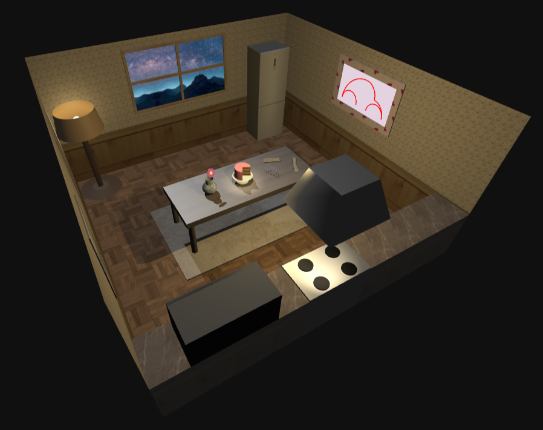
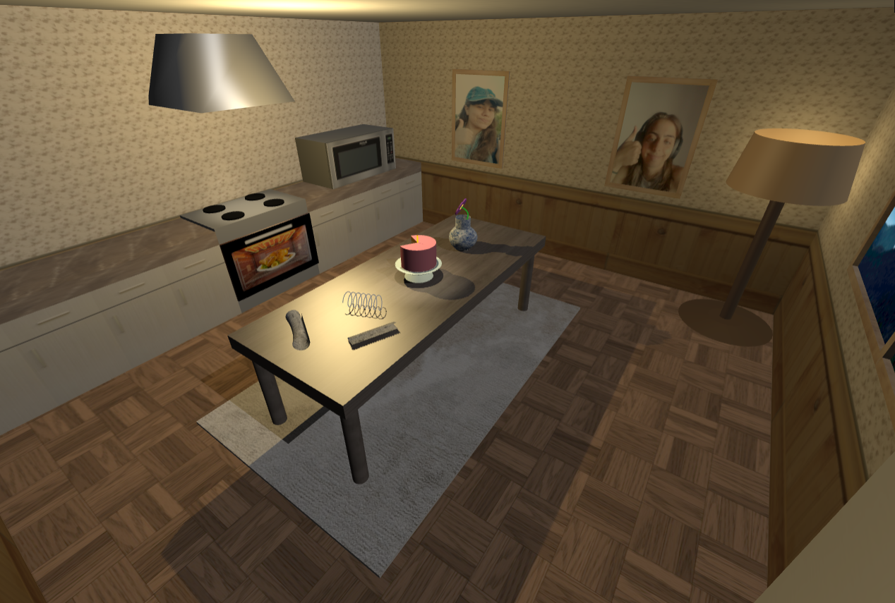
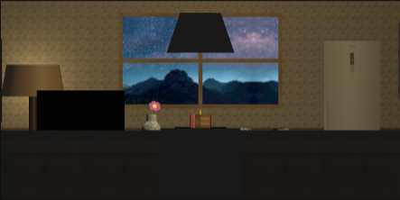
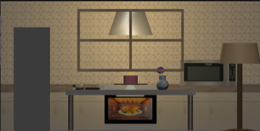
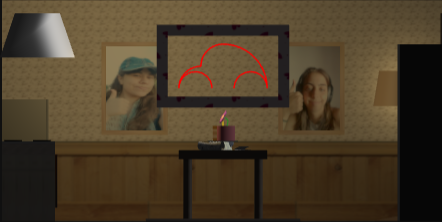
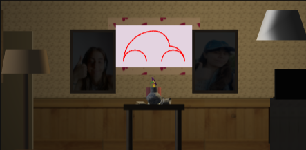
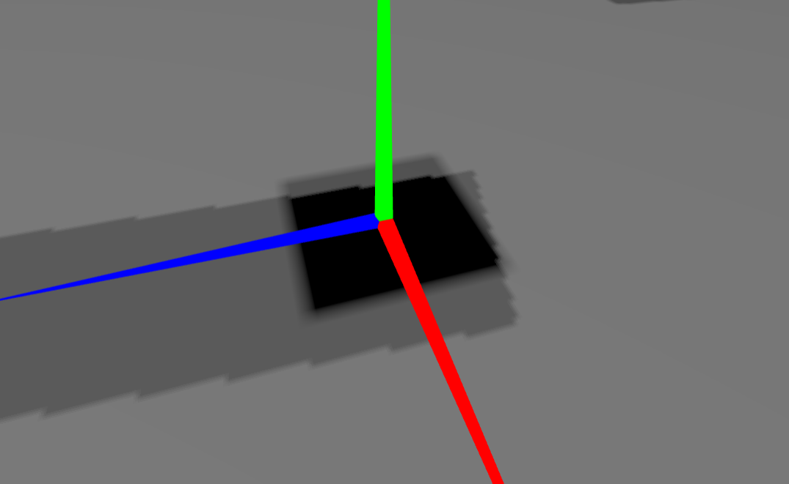
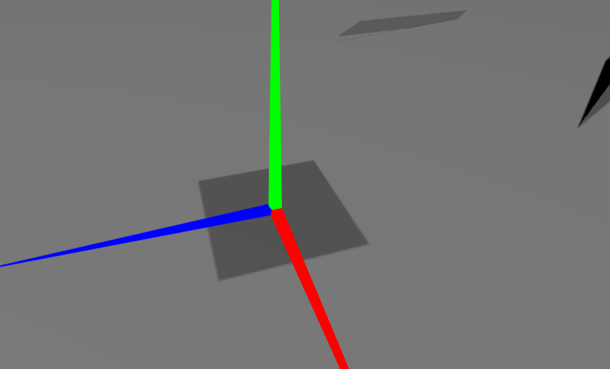

# SGI 2023/2024 - TP1

## Group: T01G05

| Name             | Number    | E-Mail             |
| ---------------- | --------- | ------------------ |
| Mariana Rocha    | 202004656 | up202004656@up.pt  |
| Matilde Silva    | 202007928 | up202007928@up.pt  |

----
## Project information
|  |  |
|:--:| :--:|
| Our scene  | 

|  |  |
|:--:| :--:|
| *Left Camera* | *Right Camera*| 

|  |  |
|:--:| :--:|
| *Front Camera* | *Back Camera*| 

- Our [Scene](/tp1/) depicts a small and cozy kitchen, getting ready for a Sunday roast! We have created various object classes ([MyTable.js](/tp1/MyTable.js), [MyCake.js](/tp1/MyCake.js), [MyCakeStand.js](/tp1/MyCakeStand.js), etc.) many of which are costumizable, meaning, you can input the measures (via the class constructor) and the object will be rendered with the desired characteristics. All specified requirements have been met.
  - The standout feature is the [window](/tp1/MyWindow.js) landscape, which makes use of the Parallax effect, changing the pictures UV coordinates with regard to the camera position.
  - Two frames with our pictures thumbing up.
  - A oven to prepare the Sunday roast.
  - A microwave to reheat the chicken on Monday.
  - A fridge to preserve the food.
  - Our [table](/tp1/MyTable.js) is created so that when it's length is incremented, extra legs will be added (every 3 units).
  - For a bit more flare, we created a [cake stand](/tp1/MyCakeStand.js), instead of a plate (two cylinders, with different top and bottom radius).
  - Our '[Carocha do Amor <3](/tp1/MyCarocha.js)' is made up of [Quarter Curves](/tp1/MyQuarterCurve.js), which, in turn, were constructed with Cubic Bezier Curves.
  - The [metal spring](/tp1/MyMola.js) is a Catmull Curve.
  - The [flower](/tp1/MyFlower.js) stem is a Cubic Bezier Curve.
  - The [Vase](/tp1/MyVase.js) is made up of two surfaces that were created with NURBs, one of them resembling a cylinder, the other, a sphere without its poles.
  - Curved lines, such as the metal spring or flower stalk, have a TubeGeometry, to improve object visibility.
  - A floor lamp to make the ambient more comfortable.
  - A carpet just for the aesthetic of it.
  - Lastly, two [newspapers](/tp1/MyNewspaper.js) (one with a fun and new shape!) were added to the scene, to showcase our exploration of NURBs curves.

----
## Issues/Problems

- When few control points were used, a great difficulty was met while creating spherical surfaces with NURBs curves.
- Even though most of the objects on the scene are costumizable, their positions have been hard-coded, which means, if the size or measurements of an objected are altered it may not remain in it's previous relative position.
- When modifying the illumination we faced some problems visualizing the position of it and its target, but the helpers did in fact help solving this difficulty.

----
## Practical Work Answers

### Geometric Transformations
- In some cases, the order of between translations and rotations can influence the object's appearence/position; however, that was not the case with the suggested operations.

### Textures and Illumination

### Curved Lines
- The 'Polylines' were used to assist on the visualization of Bezier curves, representing the lines between the control points.
- The number of Samples dictates how may points are used to create the curves and, in consequence, the number of interpolences. A higher number of samples translates into a smoother surface. This rule is applicable to both NURBs, Bezier and Catmull Curves.
- With NURBs, the orderU and orderV are the number of axis in which each direction, horizontal and vertical, respectively, will be divided.

### Shadows
- Greater valor for the shadow map resolution improve the quality that the shadows have (1024 offers a very low quality shadow compared with 4096 shadow map resolution) (picture below);
- "Cast shadow" is used for the elements that may produce a shadow on other objects and lights;
- "Receive shadow" is used for the elements that the shadows may appear;

|  |  
|:--:| :--:|
| *Shadow Map Resolution 1024* | *Shadow Map Resolution 4096*| 

