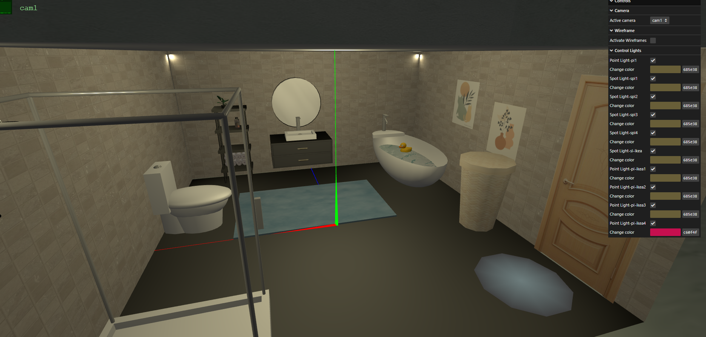

# SGI 2023/2024 - TP2

## Group T01 G05

| Name             | Number    | E-Mail             |
| ---------------- | --------- | ------------------ |
| Mariana Rocha    | 202004656 | up202004656@up.pt  |
| Matilde Silva    | 202007928 | up202007928@up.pt  |

## Nodes Parser
Our parser uses a recursive approach to build the scene graph. The ``visitNodes()`` function starts at the root node and using a **Depth-First Search** approach visits each child node consecutively. It does not skip duplicates, since we would need to create clones of nodes with one or more parents, otherwise. Each time a new node is visited, we check if it has any information regarding its material. If it does, it is then passed on to its descendents, until one of them has material information, and so on. The stopping clause of the recursive function is hit when the node is of type ``primitive`` or ``spotlight``, ``directionallight``, ``pointlight``. 

## Graphical User Interface
Our GUI includes 3 sections **Camera , Wireframes and Lights**. The Camera folder allows the user to choose which of the XML specified camera is active. Additionally, generic camera angles and perspectives are also available.

The Wireframe folder contains a checkbox that reads Activate Wireframes. When clicked, all meshes in the scene will become wireframes. When unclicked, all meshes in the scene revert back to their original state.

Lastly, the Lights folder displays all of the lights present in the scene, providing the option to change the light color or to enable/disable it.

## Our scene
Our scene illustrates an IKEA model bathroom. It includes all of the primitive types, along with LODs that show the hardware store when at the right distance. 

## Strong Points
As an extra, we decided to implement the Model3D primitive to add a special friend to the scene: a rubber duck, floating on the bathtub! We also added 3D models of a shower head and a plant model to make the scene prettier.

We made two implementations of the polygon primitive, but ultimately decided to showcase the one that blends colors smoothly between each stack.

Our code does not cause the scene to lag or faulter.

## Issues
Our code is not cleanly divided, since some functions do have a large size and could be written to be more readable.
We had some last minute problem with the shadows in our scene.

